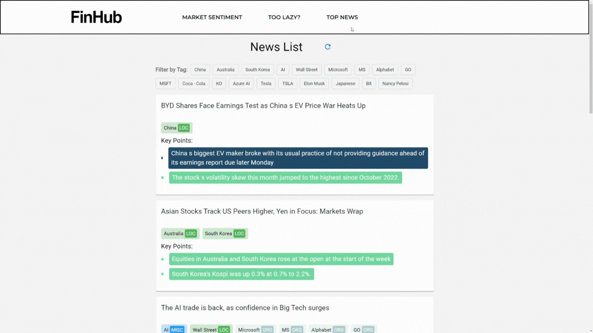

# FinHub

#Setup
## Backend 
### 1. Create Venv, install requirements, and activate

.venv\Scripts\activate

cd backend

pip install -r requirements.txt

.venv\Scripts\activate

### 2. Create .env file in the root directory, set environment key (a set of keys are provided in the report)
OPENAI_API_KEY = paste-my-key-here

STABILITY_KEY = paste-my-key-here

NEWS_API_KEY = paste-my-key-here

### 3. ffmpeg install (for link-to-audio)
#### Windows
- download from https://www.gyan.dev/ffmpeg/builds/ffmpeg-git-full.7z
- move the ffmpeg.exe and ffprobe.exe to backend/whisper_client/ffmpeg/
#### Mac (Please contact if problem, not tested since no MAC machine)
- brew install ffmpeg
  
### 4. Download our finetuned BERT model
- https://drive.google.com/drive/folders/1f73MSmtG9qHJW4UkEI_FxGBl9dYQqUye?usp=drive_link
